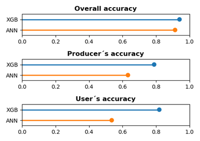
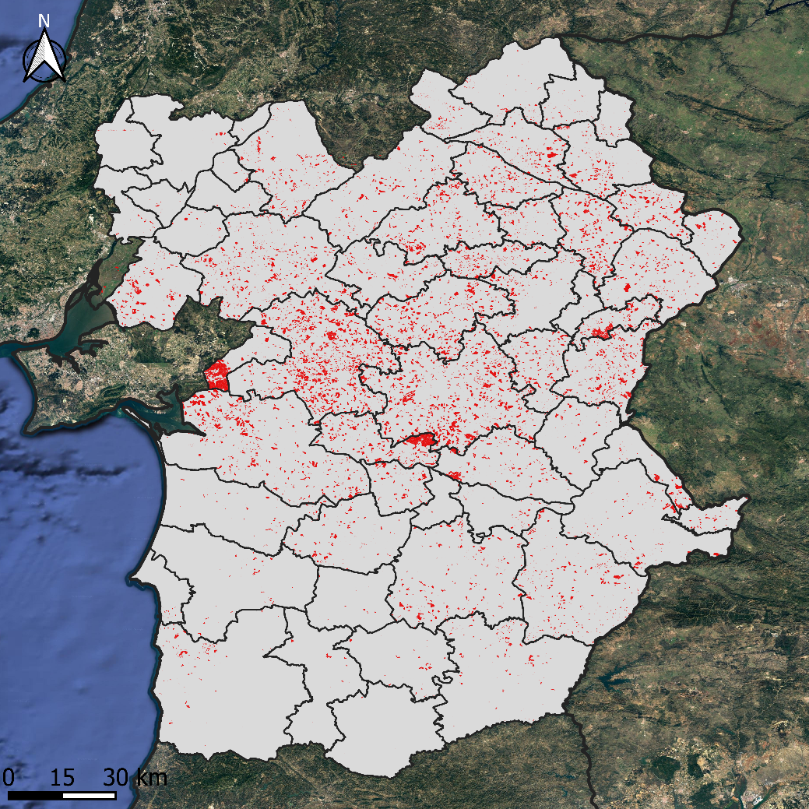
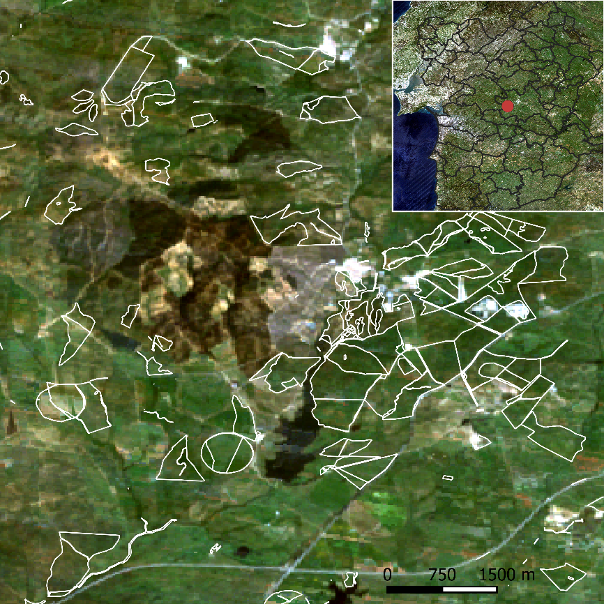

# SBP_identification

© Copyright 2023 Tiago Morais

This repository includes the algorithms (XGBoost and ANN) that was developed to identify the Sown Biodiverse Pasture system in Portugal (Alentejo region). 

The models with the highest performance are in the folder "train_models".

# Performance of the models

# Example of application of the models

# Reference
- Morais et al. (2023). **Development of an algorithm for identification of sown biodiverse pastures in Portugal.** *XX X(XX)*, XXX-XXX; (https://doi.org/10.1007/XX)
